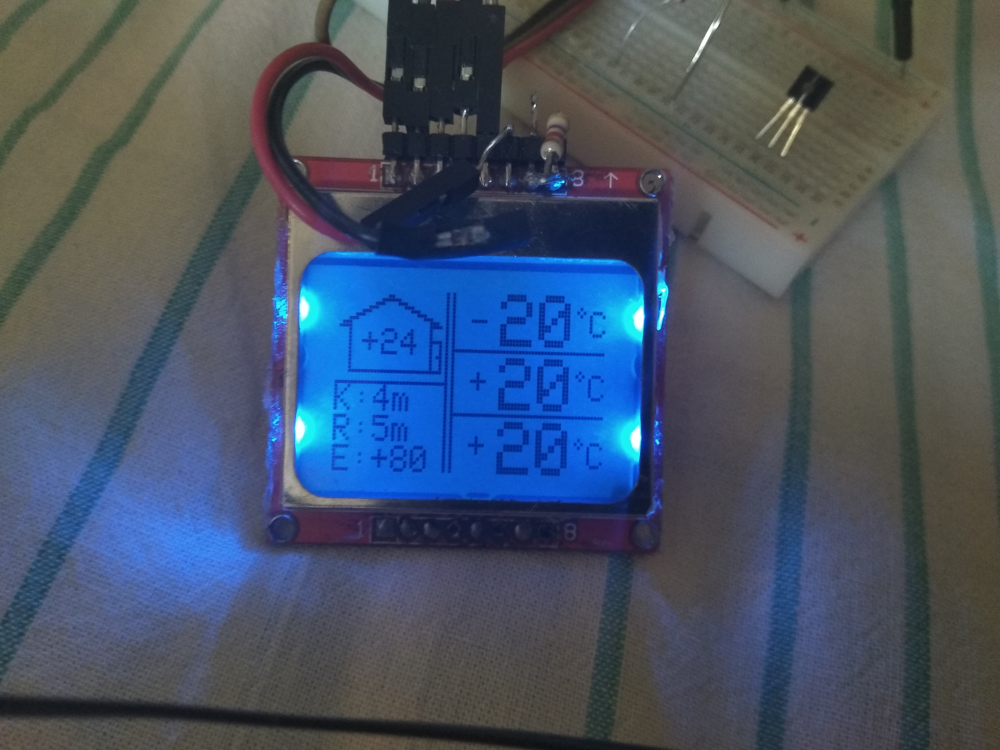
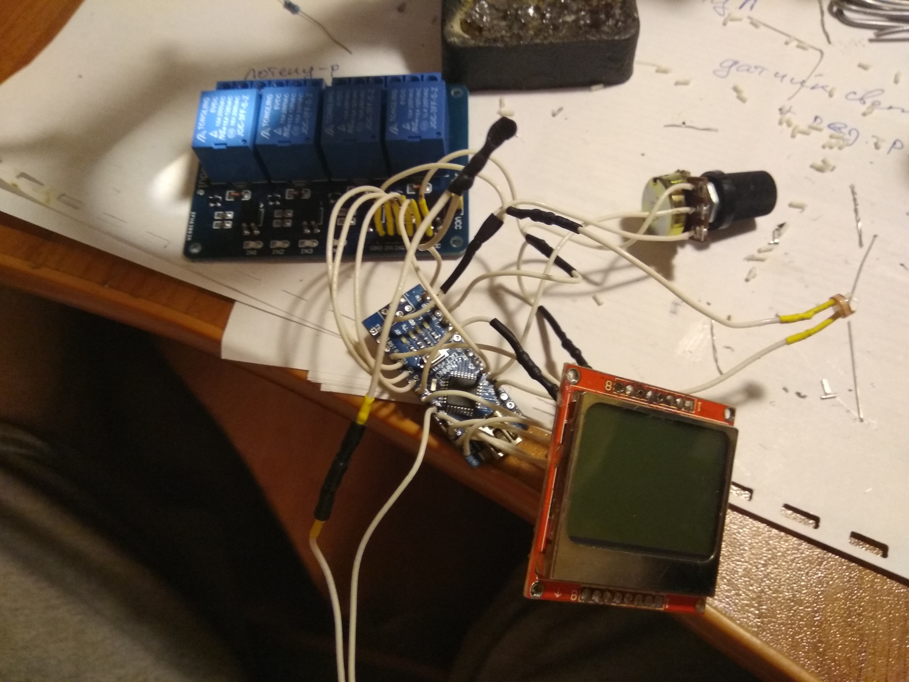
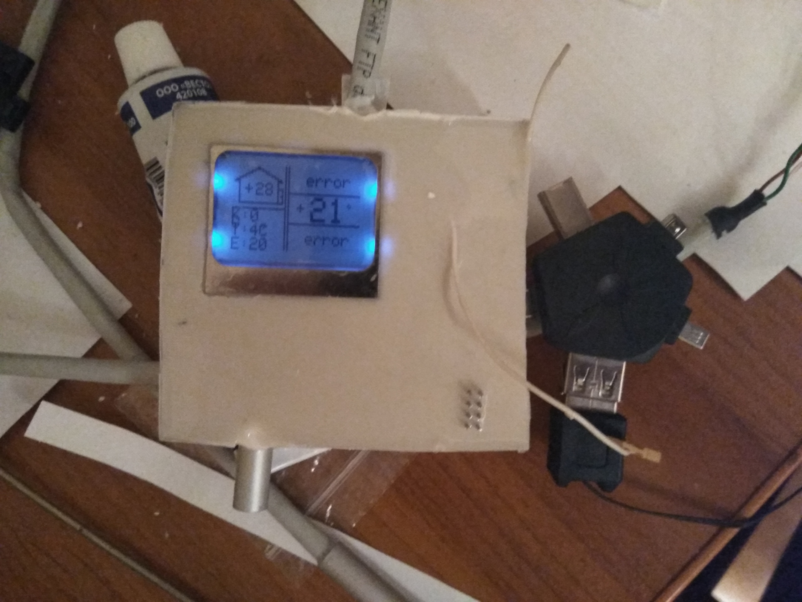

# Atlant_reborn
A conversion of a Soviet Atlant refrigerator to modern control using an MC, OneWire DS18B20 sensors, a relay unit and a display with a couple of buttons. Project implemented, source files are provided by As-Ist

<h3>Survived photographs:</h3>
Prototype:

The assembled circuit:

Ready-made device:

